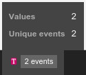
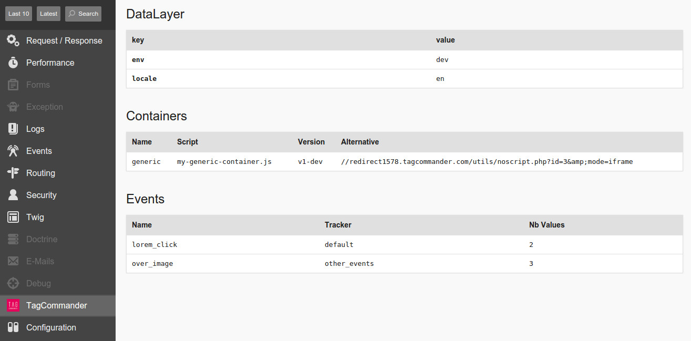

TagCommander Bundle
===================

[](https://travis-ci.org/1001Pharmacies/tagcommander-bundle)
[](https://scrutinizer-ci.com/g/1001Pharmacies/tagcommander-bundle/?branch=master)
[](https://scrutinizer-ci.com/g/1001Pharmacies/tagcommander-bundle/?branch=master)

Provides a Symfony tool pack to easily integrates TagCommander into your application.




Data from your TagCommander datalayer, containers and events will be visible in your Symfony's debug toolbar and profiler.

## Installation

Install the package with Composer :

```
composer require steamulo/tagcommander-bundle
```

Update `app/AppKernel.php` :

```php
$bundles = array(
    // ...
    new Meup\Bundle\TagcommanderBundle\MeupTagcommanderBundle(),
);
```

Setup your `app/config/config.yml`

```yaml
meup_tagcommander:
    default_event: "default"
    datalayer:
        name:    "tc_vars"
        default: { env: "%kernel.environment%", locale: "%locale%" }
    containers:
        - { name: "ab-test", script: "my-ab-test-container.js" }
        - { name: "generic", script: "my-generic-container.js", version: "v17.11", alternative: "//redirect1578.tagcommander.com/utils/noscript.php?id=3&amp;mode=iframe" }
    events:
        - { name: "default",      function: "tc_events_1" }
        - { name: "other_events", function: "tc_events_2" }
```

The `meup_tagcommander.datalayer.default` config node allows you to pre-fill your datalayer directly from your your config tree.

Then update your pages to track events :

```html
<html>
  <head>
    
    {{ tc_vars({ 'route': app.request.attributes.get('_route') }) }}
    {{ tc_container("ab-test") }}
    
  </head>
  <body>
    <!-- simple tracking sample -->
    <a href="#" onclick="javascript: return {{ tc_event('lorem_click') }}">lorem ipsum</a>
    <!-- advanced tracking sample -->
    
    <!-- rendering tag commander containers -->
    
    {{ tc_container("generic") }}
    
  </body>
</html>
```

Using `tc_datalayer` service

```
$datalayer = $container->get('tc_datalayer');
$datalayer->set('foo', 'bar');

var_dump($datalayer->all());
```
